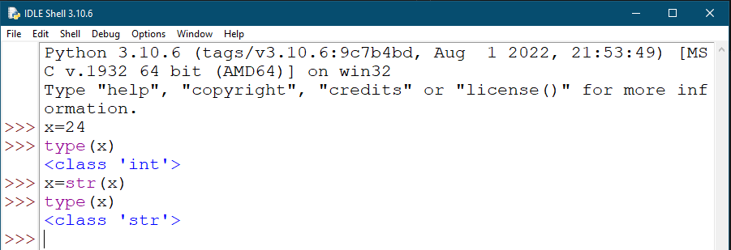
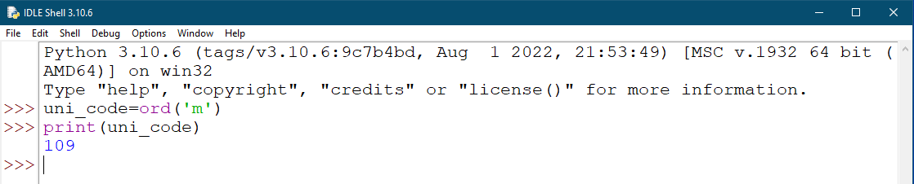
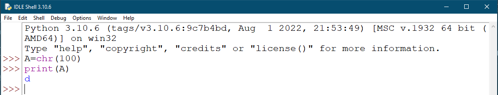
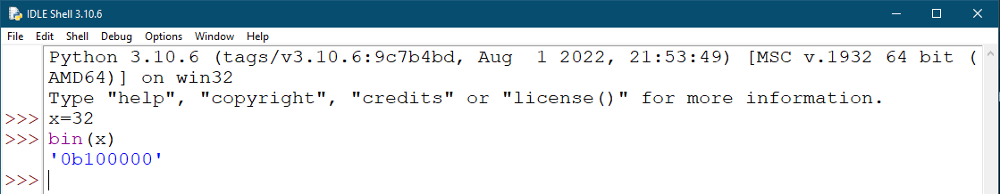
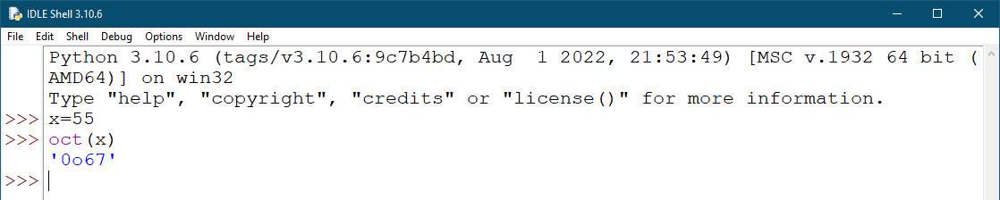
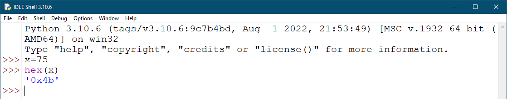
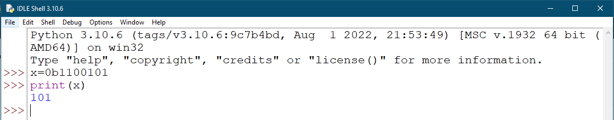
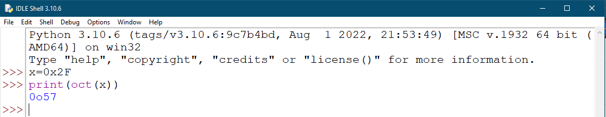
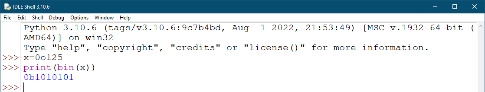
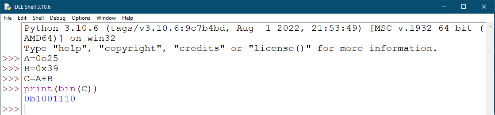

# Assignment-3: Type Conversion

    Qns 1. Write a python script to convert a number into str type.

    Ans.

    Qns 2. Write a python script to print Unicode of the character 'm'.

    Ans.

    Qns 3. Write a python script to print character representation of a given unicode 100.

    Ans.

    Qns 4. Write a python script to print any number and its binary equivalent.

    Ans.

    Qns 5. Write a python script to print any number its octa equivalent.

    Ans.

    Qns 6. Write a python script to print any number and its hexadecimal equivalent.

    Ans.

    Qns 7. Write a python script to store binary number 1100101 in a variable and print it in decimal formate.

    Ans.

    Qns 8. Write a python script to print any number 2F in a variable and print it in octa formate.

    Ans.

    Qns 9. Write a python script to store an octal number 125 in a variable and print it in binary format.

    Ans.

    Qns 10. Write a python script to add two numbers 25 (in octal) and 39 (in hexadecimal) and display the result in binary format.

    Ans.
